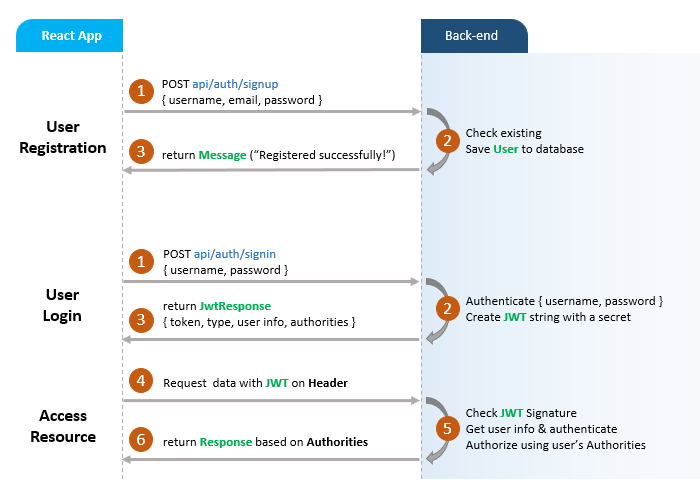
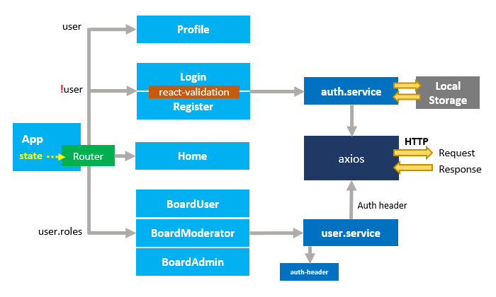

## React JWT Authentication (without Redux) example

In this tutorial, we’re gonna build a React JWT Authentication example with LocalStorage, React Router, Axios and Bootstrap (without Redux). I will show you:

- JWT Authentication Flow for User Signup & User Login
- Project Structure for React JWT Authentication (without Redux) with LocalStorage, React Router & Axios
- Creating React Components with Form Validation
- React Components for accessing protected Resources (Authorization)
- Dynamic Navigation Bar in React App

## User Registration and User Login Flow
For JWT Authentication, we’re gonna call 2 endpoints:

- POST `api/auth/signup` for User Registration
- POST `api/auth/signin` for User Login

The following flow shows you an overview of Requests and Responses that React Client will make or receive. This React Client must add a JWT to HTTP Header before sending request to protected resources.



## React Component Diagram with Router, Axios & LocalStorage



For more detail, please visit:
> [React (without Redux) JWT Authentication & Authorization example](https://github.com/JS-IT/react-jwt-auth/)

> [React Hooks: JWT Authentication & Authorization example](https://github.com/JS-IT/react-hooks-jwt-auth/)

### Set port
.env
```
PORT=8081
```

## Note:
Open `src/services/auth-header.js` and modify `return` statement for appropriate back-end (found in the tutorial).

```js
export default function authHeader() {
  const user = JSON.parse(localStorage.getItem('user'));

  if (user && user.accessToken) {
    // return { Authorization: 'Bearer ' + user.accessToken }; // for Spring Boot back-end
    return { 'x-access-token': user.accessToken };             // for Node.js Express back-end
  } else {
    return {};
  }
}
```

## Project setup

In the project directory, you can run:

```
npm install
# or
yarn install
```

or

### Compiles and hot-reloads for development

```
npm start
# or
yarn start
```

Open [http://localhost:8081](http://localhost:8081) to view it in the browser.

The page will reload if you make edits.
